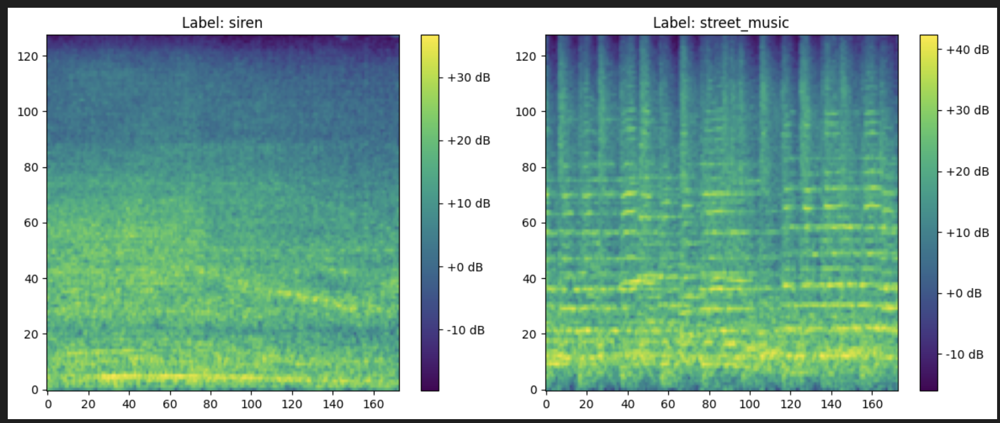

# Echo: Intelligent Urban Sound Classification

Echo is a high-performance, production-ready audio classification system designed to automatically detect and categorize environmental noise in urban settings. Built with PyTorch and optimized via ONNX, Echo provides a scalable solution for real-time acoustic monitoring.

> **Note**: If `notebook.ipynb` isn't showing normally, please try opening it in an incognito tab.

The project is designed for **Scalability** and **Ease of Deployment**, featuring:
*   **Modular Architecture**: Separate `frontend`, `backend`, and `training` modules.
*   **Fast Inference**: Uses `ONNX Runtime` and `Librosa` (No PyTorch dependency in production).
*   **Modern Tooling**: Managed by `uv` for lightning-fast dependency resolution.
*   **Containerization**: Docker-ready for **Railway** (Backend) and **Vercel** (Frontend).

## Live Demo
- **Frontend**: [https://echo-sound.vercel.app](https://echo-sound.vercel.app)
- **API Docs**: [https://echo-production-a131.up.railway.app/docs](https://echo-production-a131.up.railway.app/docs)

## Table of Contents
- [Problem Statement](#problem-statement)
- [Dataset](#dataset)
- [Project Structure](#project-structure)
- [EDA](#eda)
- [Quick Start](#quick-start)
- [Usage](#usage)
- [Dockerization & Deployment](#dockerization--deployment)
- [API Documentation](#api-documentation)

---

## Problem Statement
In the rapidly growing urban landscape, noise pollution has become a critical environmental concern affecting public health, safety, and urban planning. Monitoring these acoustic environments manually is labor-intensive and impossible to scale.

City planners, security agencies, and environmental researchers need an automated way to:

- **Identify specific noise sources**: Differentiating between harmless "street music" and critical "sirens" or "gunshots."
- **Monitor Noise Pollution**: Mapping the intensity and frequency of industrial sounds like "drilling" or "jackhammers."
- **Trigger Real-time Responses**: Enabling smart city infrastructure to react instantly when specific emergency sounds are detected.

Echo solves these challenges by providing a robust deep-learning pipeline that converts raw audio into actionable data, optimized for low-latency deployment in serverless environments.

## Dataset
**UrbanSound8K**: 8,732 labeled sound excerpts (<= 4s) from 10 classes:
*   `air_conditioner`, `car_horn`, `children_playing`, `dog_bark`, `drilling`
*   `engine_idling`, `gun_shot`, `jackhammer`, `siren`, `street_music`

## Project Structure
```
echo/
├── frontend/                  # React + Vite web app (Vercel)
│   ├── src/
│   │   ├── App.tsx            # Main app with upload & recording
│   │   └── main.tsx           # Entry point with Vercel Analytics
│   └── package.json
├── backend/                   # FastAPI backend (Railway)
│   ├── src/
│   │   ├── api.py             # FastAPI application with CORS
│   │   └── predict.py         # ONNX inference logic
│   ├── model/                 # ONNX model files
│   ├── Dockerfile
│   └── pyproject.toml         # Backend-only dependencies
├── training/                  # Training scripts
│   ├── train.py               # PyTorch training pipeline
│   └── download_data.py       # Dataset downloader
├── assets/                    # Images for documentation
├── pyproject.toml             # Root dependencies (API + training)
├── notebook.ipynb             # Training notebook with EDA
└── example.wav                # Test audio file
```

---

## EDA

### Class Distribution
The dataset exhibits class imbalance, with `gun_shot` and `car_horn` having significantly fewer samples than other classes. This is addressed during training using class weights.


### Mel Spectrograms
Audio signals are transformed into mel spectrograms for model input. Below are examples showing the visual difference between a siren (distinct frequency bands) and street music (complex harmonic patterns).



---

## Quick Start

### Prerequisites
*   **Python 3.12+**
*   **Node.js 18+** (for frontend)
*   **uv** (Package Manager): [Install Guide](https://github.com/astral-sh/uv)
    ```bash
    curl -LsSf https://astral.sh/uv/install.sh | sh
    ```

### Install Dependencies
```bash
# Clone the repository
git clone https://github.com/datalordstephen/echo.git
cd echo

# Install all dependencies (API + training)
uv sync --extra training

# Simply test the API
uv sync
```

---

## Usage

### Run the API Locally
```bash
cd backend
uv run uvicorn src.api:app --reload --port 8000
```
Test it at `http://localhost:8000/docs`.

### Run the Frontend Locally
```bash
cd frontend
npm install
npm run dev
```
Open `http://localhost:5173` in your browser.

### Train the Model

1. **Download the dataset:**
    ```bash
    uv run python training/download_data.py
    ```
    This downloads UrbanSound8K to `urbansound8k/` in the project root.

2. **Run training:**
    ```bash
    uv run python training/train.py
    ```
    This trains the model, validates on the hold-out fold, and exports to `model/echo_audio_clf.onnx`.

3. **Copy model to backend (for deployment - optional):**
    ```bash
    cp model/echo_audio_clf.onnx* backend/model/
    ```

### Test Deployed API
```bash
uv run python test_api.py
```

---

## Dockerization & Deployment

### Run Backend with Docker Locally
The strict separation of base vs training dependencies ensures the Docker image is small (no PyTorch).

1.  **Build the Image:**
    ```bash
    cd backend
    docker build -t echo-api .
    ```

2.  **Run the Container:**
    ```bash
    docker run -p 8000:8000 echo-api
    ```

3.  **Test:**
    ```bash
    curl -X POST "http://localhost:8000/predict" -F "file=@example.wav"
    ```

### Deploy Backend to Railway
The `backend/` directory is self-contained for Railway deployment.

1. Push code to GitHub.
2. Create a new project on [Railway](https://railway.app/).
3. Select **"Deploy from GitHub repo"** and choose `echo`.
4. Set the **Root Directory** to `backend`.
5. Railway detects the `Dockerfile` and deploys automatically.

### Deploy Frontend to Vercel
1. Import your GitHub repo on [Vercel](https://vercel.com/).
2. Set the **Root Directory** to `frontend`.
3. Add environment variable: `VITE_API_URL=https://your-railway-url.up.railway.app`
4. Deploy.

---

## API Documentation

### POST `/predict`
Uploads an audio file for classification.

**Request:** `multipart/form-data`
*   `file`: Audio file (.wav recommended)

**Response:**
```json
{
    "class": "dog_bark",
    "class_id": 3,
    "confidence": 0.9982712268829346
}
```

### GET `/health`
Health check endpoint.
```json
{
  "status": "healthy",
  "model_loaded": true
}
```
